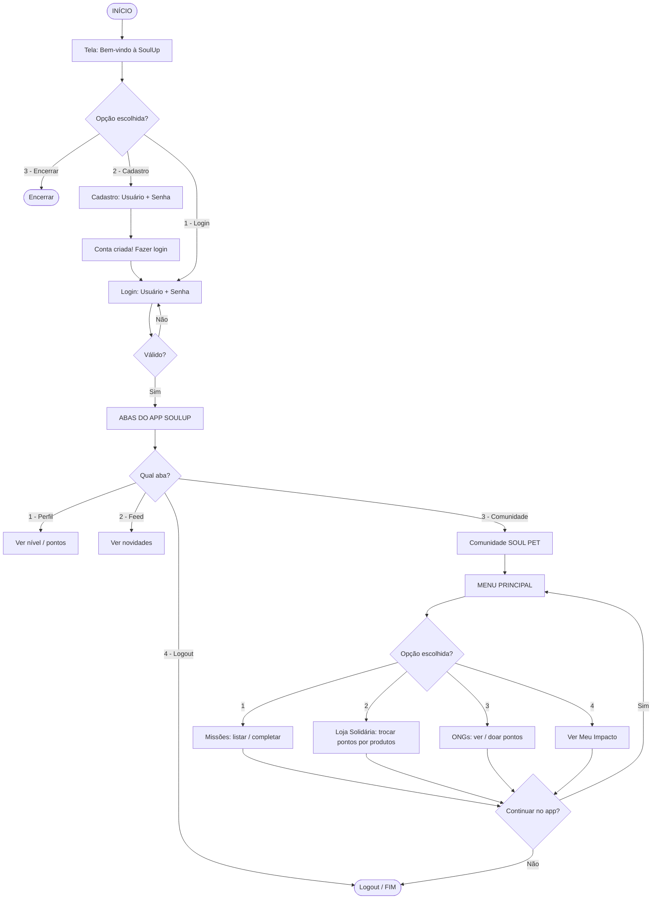

<h1 align="center">🐾 SoulPet</h1>

<p align="center">
  <i>Marketplace de Impacto e Proteção Animal — uma comunidade dentro do app da SoulUp.</i>
</p>

<p align="center">
  
  
  
  
</p>

<p align="center">
  <a href="https://youtu.be/tsRAweBAXCY" target="_blank">
    
  </a>
</p>

---

## 📌 Sobre o projeto

A **SoulUp**, primeira rede social de impacto ambiental do Brasil, lançou em parceria com a **FIAP** três desafios de inovação. A **InovaLab** escolheu o **Desafio 01**: criar um sistema que avalie, pontue e incentive ações sustentáveis de forma eficiente e escalável.

A **SoulPet** nasce como uma comunidade dentro do app da SoulUp, funcionando como um **Marketplace de Impacto** voltado à proteção animal — conectando três lados: **usuários** que querem gerar impacto real, **ONGs** que precisam de recursos e visibilidade, e **marcas sustentáveis** engajadas com causas sociais.

> 🐶 Segundo o Instituto Pet Brasil, há mais de **30 milhões de animais abandonados** no país. A SoulPet transforma engajamento digital em impacto animal mensurável.

## 🎯 Objetivos

- 🏘️ Desenvolver a SoulPet como **Marketplace de Impacto** para proteção animal dentro da SoulUp.
- 🎮 Criar um sistema de **gamificação** com missões, pontuação e níveis para engajamento contínuo.
- 🤝 Conectar usuários a **ONGs parceiras**, permitindo doação de pontos ou compra de produtos que revertem valor.
- 📊 Transformar engajamento digital em **impacto animal mensurável**, mostrando quantos animais o usuário ajudou.
- 💼 Garantir um **modelo financeiro escalável**, sustentado por marcas parceiras e plano premium.

## ✨ Funcionalidades do sistema

| Módulo | Descrição |
|---|---|
| 🎯 **Sistema de Missões** | Desafios diários, semanais e mensais que recompensam o usuário com **ecopontos**. |
| 🛒 **Loja Solidária** | Marketplace para trocar pontos por cupons ou produtos de marcas parceiras sustentáveis. |
| 🏥 **ONGs Parceiras** | Busca e listagem de ONGs validadas para transferência de pontos convertidos em ajuda real (ração, remédios). |
| 📈 **Painel Meu Impacto** | Histórico transparente de vidas salvas e recursos doados pelo usuário. |
| ⭐ **Plano Premium** | Assinatura mensal com multiplicadores de pontos (pontos em dobro) e acesso antecipado a eventos de adoção. |

## 🗺️ Fluxograma de navegação



## 🚀 Como executar

Pré-requisitos: **Python 3.10+** instalado.

```bash
# 1. Clone o repositório
git clone https://github.com/thaylira2026-hub/soulpet.git

# 2. Entre na pasta do projeto
cd soulpet

# 3. Execute a aplicação
python soulpet.py
```

> 💡 Ajuste o nome do arquivo principal (`soulpet.py`) conforme o seu código.

## 🛠️ Tecnologias

<p align="left">
  
</p>

## 🎥 Vídeo Pitch

Apresentação dos objetivos, justificativa e funcionalidades da solução:  
👉 **[Assista no YouTube](https://youtu.be/tsRAweBAXCY)**

## 👥 Equipe

| Nome 
|---|
| Bianca Pereira da Silva
| Isabelle Souza Lima Pires Araújo 
| Maria Eduarda Cavallari Quarelo
| Thays Lira de Oliveira 

---

<p align="center">
  Projeto acadêmico desenvolvido na <strong>FIAP</strong> — Análise e Desenvolvimento de Sistemas 🎓<br/>
  <i>InovaLab • SoulUp • 2026</i>
</p>
